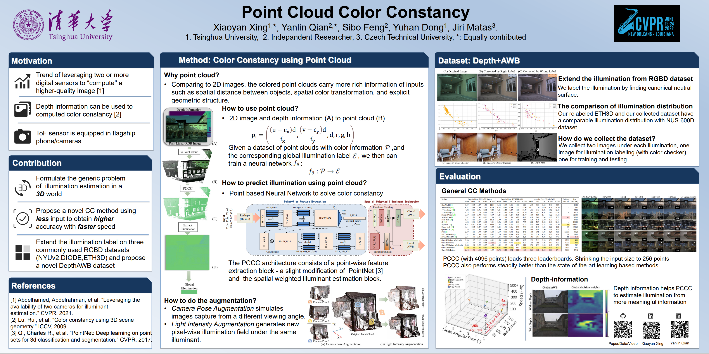

# Point-Cloud-Color-Constancy

CVPR 2022：Point Cloud Color Constancy

\[[pdf](https://openaccess.thecvf.com/content/CVPR2022/html/Xing_Point_Cloud_Color_Constancy_CVPR_2022_paper.html)\]   \[[data](https://drive.google.com/drive/folders/1qBw_bvaxIvduIm2vzrYhEPX9khTm1Bo9?usp=sharing)\] 



## Data

### Introduction 

We provide the extended illumination labels of NYU-v2, DIODE, and ETH3D as well as the point cloud, the raw format image(for ETH3D), and the linearization sRGB image (for NYU-2 and DIODE). 

Each dataset consists of following parts:

- PointCloud: with resolution of 256 points and 4096 points.
- Label: illumination label 
- Image: raw linear RGB image (Depth-AWB & ETH3D), linearized sRGB image (NYU-v2/DIODE).
- Folds: how we split the different folds for cross validation.

For the full depth information and images on the three open-source datasets, please refer to their website.

NYU-v2：https://cs.nyu.edu/~silberman/datasets/nyu_depth_v2.html

DIODE：https://diode-dataset.org/

ETH3D: https://www.eth3d.net/datasets#high-res-multi-view


## Code

We provide an example of the data processing, which include the image aligned, point cloud building, and point cloud visualization (based on open3D). We also provide the train & test code of the PCCC network.

### Environment & Packages

For creating a new environment on sever

```shell
conda env -f create environment.yaml
```

For adding the necessary packages

```shell
pytorch==1.2.0
torchvision==0.4.0
open3D #(for point cloud visualization)
openCV
```

### Data processing

If you use our depthAWB data for training, you can skip this phase. If you use your own data, you can refer to `PcdGeneration.py` to create your own point cloud data and visualize it. 

### Network 

For training

```shell
python train_main.py --datasets NAME OF DATASET --foldn FOLD NUMBER --sizes INPUT SIZE OF POINT --batch_size BATCH SIZE --nepoch EPOCH --gpu_ids GPU ID
```

For evaluation

```shell
python test_main.py --datasets NAME OF DATASET --foldn FOLD NUMBER --sizes INPUT SIZE OF POINT --pth_path PTH MODEL PATH
```

The `./pointnet/DataLoader.py` can be changed if your use your own data.

## Citation

If our work helps you, please cite us:

```latex
@InProceedings{Xing_2022_PCCC,
    author    = {Xing, Xiaoyan and Qian, Yanlin and Feng, Sibo and Dong, Yuhan and Matas, Ji\v{r}{\'\i}},
    title     = {Point Cloud Color Constancy},
    booktitle = {Proceedings of the IEEE/CVF Conference on Computer Vision and Pattern Recognition (CVPR)},
    month     = {June},
    year      = {2022},
    pages     = {19750-19759}
}
```

## Acknowledgement

This code of PCCC network is developed on the bias of [PointNet.Pytorch](https://github.com/fxia22/pointnet.pytorch) and  [PointNet2.Pytorch](https://github.com/yanx27/Pointnet_Pointnet2_pytorch). We thank the authors for their contribution.

